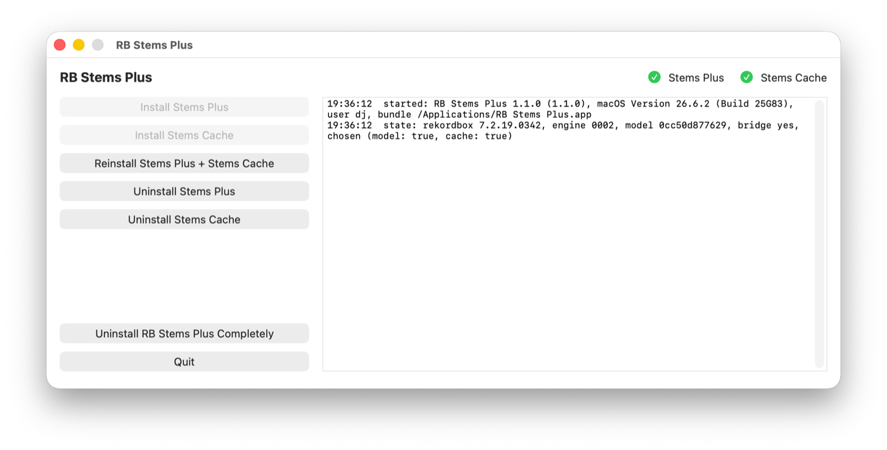
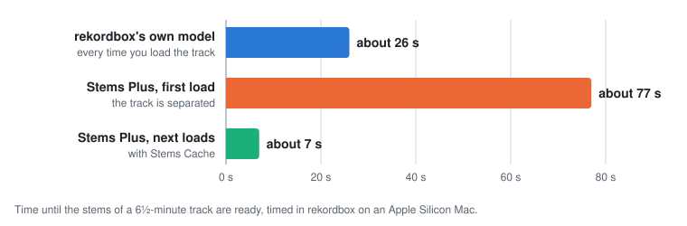
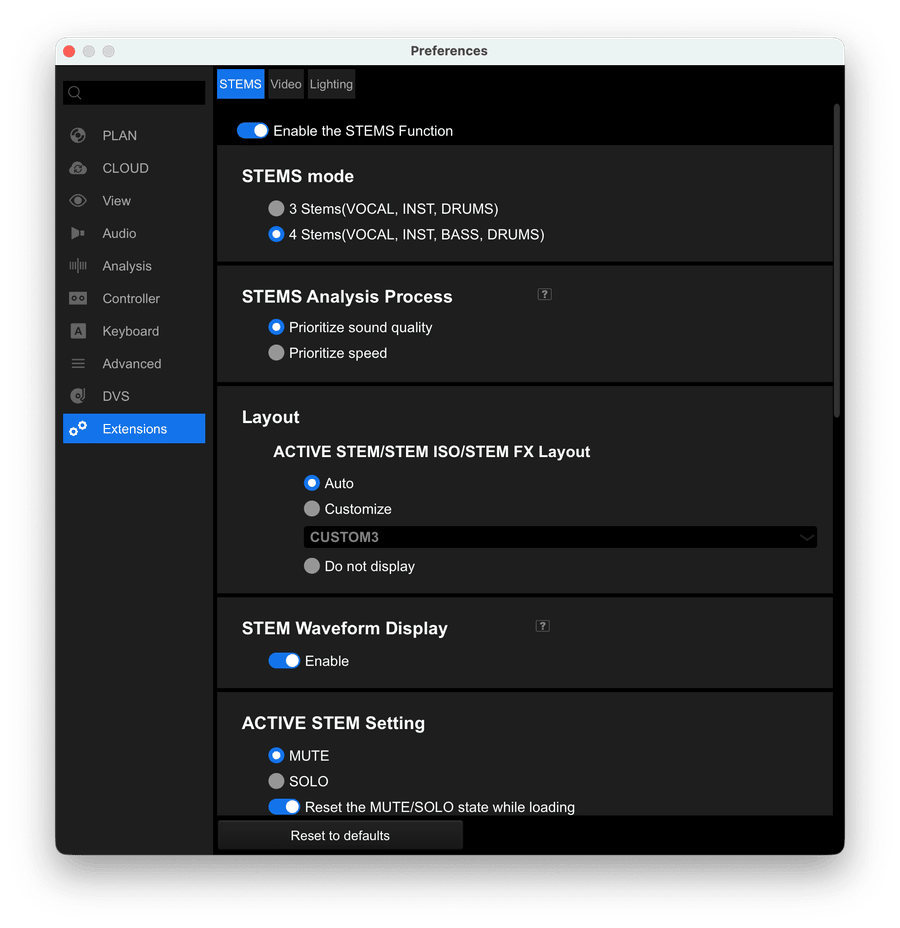
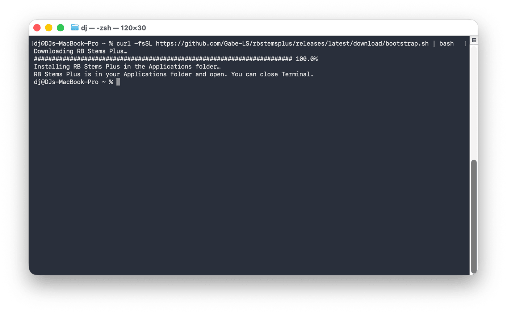
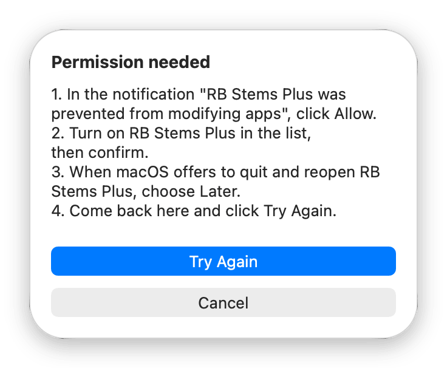
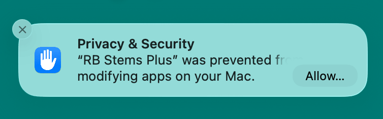
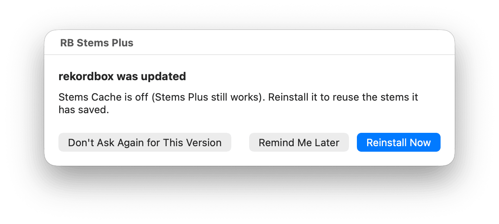
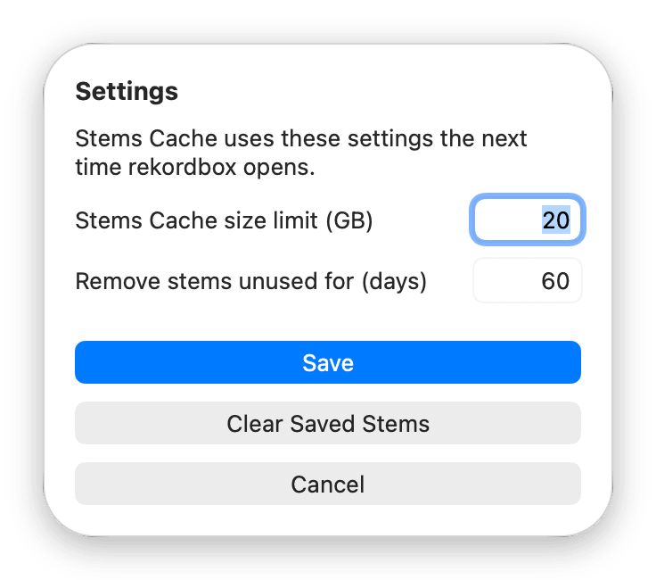
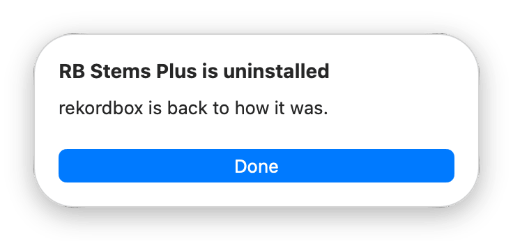

# RB Stems Plus

**A different stems model and much faster reloads for rekordbox's STEMS, on the Mac.** Free and
open source.

[What it does](#what-it-does) · [What you get](#what-you-get) · [Install](#install) ·
[FAQ](#faq) · [Troubleshooting](docs/troubleshooting.md) · [Get help](#get-help)



## What it does

**Stems** are the parts of a track pulled apart: vocals, drums, bass and the rest of the music
(rekordbox calls it Inst). With STEMS in rekordbox you can mute or solo each part live, for
example drop the vocals for an instrumental or keep only the vocals for an acapella. rekordbox
works the stems out on your Mac with a "model": a program trained to tell the parts apart.

RB Stems Plus is a small app with two features:

- **Stems Plus: a different stems model.** It swaps rekordbox's model for Demucs v4, the newer
  version of Meta's open source separation model that rekordbox's own is based on. It doesn't
  change the rekordbox app.
- **Stems Cache: much faster reloads.** rekordbox separates a track again every time you load
  it. Stems Cache keeps the stems it already made, so the next time you load that track they
  come back in seconds, without separating the track again. It works with either model,
  rekordbox's own or Stems Plus, and it changes one file inside rekordbox (see
  [Honest risks](#honest-risks)).

Install either one, or both.

## What you get

### Which model sounds better? It depends on your music

rekordbox's own model is Demucs v3, retuned by Pioneer. Stems Plus uses Demucs v4, Meta's newer
version. They split some sounds differently, and which split is better depends on the music, and
on the stem:

- **Pop, rock and rap:** on MUSDB18, a standard test of 50 songs with their real stems, Stems Plus
  came closer to the real stems on every stem: bass on 45 of 50 songs, drums on 44, the rest of
  the music on 41, vocals on 36.
- **Electronic tracks:** on six electronic productions with their producers' stems, Stems Plus was
  closer on drums and bass (about 2.5 dB at the median, roughly 40% less bleed), and rekordbox's
  model on vocals and the rest of the music. Not on every track: one went to rekordbox's model on
  bass too.
- **Rumble techno:** on *Lunfardo* by Ignez, rekordbox's model keeps a short low note before each
  kick in the bass stem. Stems Plus puts it in the drums until the track opens up, and to our
  ears rekordbox's split was closer. We tried many other models on the same minute and got
  different results from each:
  - Meta's htdemucs, htdemucs_ft and mdx_extra, and ZFTurbo's SCNet and BS-RoFormer did the same
    as Stems Plus;
  - Demucs v4's six-stem version and Meta's original Demucs v3 caught part of it;
  - AudioShake and Ableton Live's stem separation each made yet another split.
- **Synthetic techno loops with known stems:** close. With a held sub bass Stems Plus came closer
  on average. With short rolling bass notes both did much worse, and rekordbox's model was
  slightly closer on 5 of 8 loops.

So try both on your own tracks and keep the one you like. **Uninstall Stems Plus** puts
rekordbox's model back any time, and **Install Stems Plus** brings Stems Plus back. Stems Cache
works with both and keeps the stems saved with each.

### Faster reloads, and the price

The Stems Plus model does more work, so the first STEMS on a track takes longer. Stems Cache
saves the stems once a track is separated, with either model, so every later load is much
faster.

<picture>
  <source media="(prefers-color-scheme: dark)" srcset="docs/images/stems-load-time-dark.svg">
  
</picture>

Timed in rekordbox on an Apple Silicon Mac, from loading a 6½-minute track to its stems being
ready. Stems Plus separates about 5 times faster than the music plays, rekordbox's own model
about 15 times.

**Memory:** rekordbox's own model uses about 1.42 GB at its peak. The Stems Plus model, run
with rekordbox's usual settings, peaks at about 2.30 GB. With Stems Cache installed it runs with
a leaner setting and peaks at about 1.52 GB, with the same speed and the same stems.

## Before you install

- **A Mac.** Tested on macOS 26 Tahoe on an Apple Silicon Mac.
- **rekordbox 7** in `/Applications/rekordbox 7`, with STEMS working, and turned on at least
  once so rekordbox has downloaded its **STEMS Engine** (the files STEMS needs).
- **An administrator account** on the Mac (the one that can install apps), for Stems Cache.
- **Disk space:** about 1.5 GB for RB Stems Plus (the model, a spare copy, and the copies of
  rekordbox's files it keeps so it can put them back). The app checks first and says if it
  needs more. Then room for saved stems: at most 20 GB by default, which you can change.

Stems Cache stops saving new stems when your disk gets low: under 10% of the disk free, 50 GB
at most (about 25 GB on a 256 GB Mac). Stems it already saved still load.

Where to find STEMS in rekordbox: **Preferences › Extensions › STEMS**, with **Enable the STEMS
Function** on.



## Install

1. **Quit rekordbox.**
2. **Open Terminal** (press Cmd+Space, type *Terminal*, press Return), paste this line and press
   Return:

   ```sh
   curl -fsSL https://github.com/Gabe-LS/rbstemsplus/releases/latest/download/bootstrap.sh | bash
   ```

   It puts **RB Stems Plus** in your Applications folder and opens it. You can close Terminal.

   

3. **Click Install Stems Cache, Install Stems Plus, or both, one after the other** (after
   **Continue** on the welcome message), and **Install** to confirm each. If a button is greyed
   out, the line under the buttons says why (see [Troubleshooting](docs/troubleshooting.md)).
   - **Stems Plus** downloads the model (about 300 MB) and puts it in place. No password.
   - **Stems Cache** needs your password and, the first time, macOS's permission (steps 4
     and 5).
4. **Type your password** when it asks (*Password needed*), then click **Continue**.
5. **The first time only, allow RB Stems Plus in macOS.** macOS says *"RB Stems Plus was
   prevented from modifying apps"*, and the app shows you these steps:
   1. In the notification, click **Allow**.
   2. Turn on **RB Stems Plus** in the list, then confirm.
   3. When macOS offers to quit and reopen RB Stems Plus, choose **Later**.
   4. Back in RB Stems Plus, click **Try Again**.

    

   Installing Stems Cache takes about a minute. When the light of what you installed is green,
   you're done.
6. **Open rekordbox, load a track and turn on STEMS.** With Stems Plus the first time takes
   longer than before. Load it again later: with Stems Cache it's much faster.

**Changed your mind?** Each feature can be added or removed on its own any time.

### What else you'll see

- **A notice that "RB Stems Plus Watcher" can run in the background.** That's RB Stems Plus's
  small helper that tells you when a rekordbox update needs a reinstall. It only asks, it never
  changes anything by itself.
- **With Stems Cache, at every rekordbox update:** macOS says *"rekordbox was prevented from
  modifying apps"*. Click **Allow** so the update can finish. This is expected: Stems Cache
  re-signs rekordbox on your Mac, so macOS asks before Pioneer's updater replaces it.
- **macOS asks again for RB Stems Plus** after RB Stems Plus updates itself, the next time it
  installs, reinstalls or removes Stems Cache. Same steps as above.
- **Sometimes macOS doesn't ask at all,** for example right after rekordbox was installed or
  updated. That's normal.

### The lights

The two lights at the top show each feature: a **green check** means it's on, a **red cross**
means it's off. Stems Cache's light turns **yellow** when it's installed but not saving stems
right now, for example when the disk is low or rekordbox has a STEMS Engine that Stems Cache
doesn't support yet: hold the pointer over it to see why. Anything that can't be installed is
explained in the line under the buttons.

## After a rekordbox update

- **A rekordbox update** puts Pioneer's original rekordbox back, so Stems Cache is off until you
  reinstall it. Stems Plus keeps working, and your saved stems are kept.
- **A new STEMS Engine** puts rekordbox's own model back, so Stems Plus is off. Stems Cache goes
  on saving stems if it supports that STEMS Engine; if not yet, its light turns yellow until
  an RB Stems Plus update does.

When the update is done and rekordbox is closed, RB Stems Plus asks: **Reinstall Now**,
**Remind Me Later** or **Don't Ask Again for This Version**. **Reinstall Now** opens the app and
reinstalls only what went missing. Or open the app any time and click **Reinstall**.

If RB Stems Plus doesn't support the new version yet, it says so instead, checks again each time
you open it, and asks you to reinstall once it can.



## Updating RB Stems Plus

When you open it, RB Stems Plus checks (at most once a day) for a newer version. If there is
one, the line under the buttons says *"RB Stems Plus X is available"*, and **Update RB Stems
Plus** appears in the RB Stems Plus menu. The new version replaces the old one in one step. If
the update can't finish, RB Stems Plus stays as it was and tells you why the next time it opens.

## Settings

**RB Stems Plus › Settings…** (Cmd+,) sets how much space saved stems may use (20 GB by default)
and after how many days unused stems are removed (60 by default). They apply the next time
rekordbox opens. **Clear Saved Stems** frees the space now.



## Uninstall

Open RB Stems Plus and click:
- **Uninstall Stems Cache:** rekordbox gets Pioneer's original files back, byte for byte.
- **Uninstall Stems Plus:** rekordbox gets its own stems model back. Stems Cache, if you have it,
  goes on saving stems with that model.
- **Uninstall RB Stems Plus Completely:** rekordbox goes back to exactly how it was, and RB Stems
  Plus deletes itself, its settings, its logs and the stems it saved.

Your music and your rekordbox library are never touched. The complete uninstall ends with this:



## Honest risks

- **It's unofficial.** AlphaTheta doesn't know about it or support it. A future rekordbox could
  change how STEMS works. RB Stems Plus then leaves rekordbox on its own model until it's
  updated.
- **It changes rekordbox's files.** Stems Plus replaces rekordbox's model file. Stems Cache
  replaces one file inside rekordbox.app and re-signs the app on your Mac, so while it's
  installed rekordbox is no longer signed by AlphaTheta. Pioneer's originals are kept, and
  uninstalling puts everything back. Reinstalling rekordbox from rekordbox.com also always gives
  you Pioneer's app.
- **rekordbox's licence (EULA) doesn't allow modifying the program.** Stems Cache clearly does,
  and swapping the model arguably does too. In our tests rekordbox sent nothing about it, but we
  can't promise that stays true. If you contact AlphaTheta support, uninstall first.
- **No warranty.** It's free software under the MIT licence, provided as is. Tested with rekordbox
  7.2.17 to 7.2.19 on macOS 26 Tahoe on an Apple Silicon Mac.
- **Never try new software for the first time at a gig.**

## Privacy and security

- **Nothing is sent anywhere.** No tracking, no accounts. RB Stems Plus only goes online to
  download its own files from this project's GitHub Releases.
- **Releases are signed.** Each release comes with a signed list of its files. The install
  command and the app check that signature, and each file's checksum (a fingerprint of the
  file), before using anything.
- **Logs stay on your Mac** (`~/Library/Logs/rbstemsplus`). They never contain your audio or
  track names.
- **A problem report is never sent automatically.** You make it and attach it yourself (see
  [Get help](#get-help)).

## FAQ

**Is it free? What's the catch?** Free and open source (MIT licence). The catch is in
[Honest risks](#honest-risks): it's unofficial, and Stems Cache changes one file in rekordbox.

**Is it safe to paste a command into Terminal?** The line downloads a short script from this
project's GitHub Releases. It checks every file against the release's signed list before it
puts the app in Applications. You can [read it first](scripts/bootstrap.sh).

**Why a command instead of a normal download?** Apps downloaded in a browser from developers
without a paid Apple account trigger macOS's "damaged" or "unidentified developer" warnings.
The command avoids them.

**Will it break rekordbox?** Stems Plus swaps only the model file. Stems Cache replaces one file
inside rekordbox and keeps Pioneer's original, which uninstalling puts back. If anything goes
wrong, reinstalling rekordbox from rekordbox.com gives you Pioneer's app again.

**Will it touch my library, playlists, cues or music?** No. It never opens them, and
uninstalling doesn't touch them either.

**Is it allowed? Can AlphaTheta ban my account?** It unlocks nothing you don't already have.
But rekordbox's licence doesn't allow modifying the program, and Stems Cache does. In our tests
rekordbox sent nothing about it. See [Honest risks](#honest-risks).

**Which rekordbox plan do I need?** One rule answers this and the next few questions: **if STEMS
works in your rekordbox, RB Stems Plus works with it. If it doesn't, RB Stems Plus can't add
it.**

**Does it work with my controller, CDJs or USB exports?** RB Stems Plus only changes the
separation done inside rekordbox on your Mac. A controller just controls rekordbox, so it gets
the Stems Plus stems. It doesn't touch USB exports, CDJs or any other hardware.

**Does it work with streaming tracks?** No. rekordbox doesn't separate streaming tracks, so STEMS,
and RB Stems Plus with it, works only on tracks you have as files.

**Which rekordbox versions work?** rekordbox 7. Stems Plus works with the STEMS Engine versions
it knows; Stems Cache only with the rekordbox versions it was tested on (7.2.17 to 7.2.19 at
release). The list is updated online, and the app tells you if your version isn't on it yet.

**Which Macs? Windows?** Mac only. Tested on macOS 26 Tahoe on an Apple Silicon Mac.

**Do I need both features?** No. Each works on its own: Stems Plus changes the model, Stems Cache
saves the stems of whichever model rekordbox uses. Install one, both, or add the other later.

**Will my tracks sound better?** It depends on your music: see
[Which model sounds better?](#which-model-sounds-better-it-depends-on-your-music). If you prefer
rekordbox's model, **Uninstall Stems Plus** brings it back any time.

**Does it work offline, at a gig?** Yes. Separating tracks and loading saved stems happen on
your Mac, with no internet needed (we tested it with the network off).
Installing needs internet. Reinstalling works offline from the files already on your Mac (for
Stems Cache, only if they were downloaded in the last 7 days).

**Can I prepare my tracks before a gig?** Load each track once with STEMS on and let rekordbox
separate it: Stems Cache saves the stems. Stems unused for 60 days are removed, which you can
change in [Settings](#settings).

**Do saved stems survive restarts, updates, renaming or moving tracks?** Yes. They stay until
the size limit, the day limit or **Clear Saved Stems** removes them. They're found by the audio
itself, so renaming, re-tagging or moving a track (or the whole drive) doesn't matter. After a
rekordbox update, reinstall Stems Cache to use them again. Stems saved with one model are used
only with that model: switch back and they load again.

**Does it change BPM, key, waveforms or analysis?** No. Only the stems model changes.
Everything else rekordbox does runs on its own files, unchanged.

**Does the app need to stay open?** No. Its small helper, **RB Stems Plus Watcher**, runs in
the background and asks you to reinstall after a rekordbox update. If you turn it off (System
Settings › General › Login Items & Extensions), the app says *"Reinstall reminders are off"*:
then open it after rekordbox updates.

**Do I have to reinstall after every rekordbox update?** For Stems Cache, yes: RB Stems Plus
asks when the update is done (one click). Stems Plus survives rekordbox
updates, but not a new STEMS Engine download.

**Can I change how much space saved stems use?** Yes, in [Settings](#settings). The stems are in
`~/Library/Caches/rbstemsplus`. Don't move that folder or replace it with a link.

**Something's wrong.** See [Troubleshooting](docs/troubleshooting.md), also in the app under
**Help › RB Stems Plus Troubleshooting**.

## Get help

Help happens in this project's [GitHub issues](https://github.com/Gabe-LS/rbstemsplus/issues).
You need a free GitHub account.

1. In RB Stems Plus, choose **Help › Create Report**. It saves a zip on your Desktop.
2. Click **Open GitHub Issue**. Your browser opens a new issue with the technical details already
   filled in, and Finder shows the zip.
3. Write what happened under *What happened?*, drag the zip into the issue, and submit it.

The report holds RB Stems Plus's logs and settings, the versions of macOS, rekordbox and RB Stems
Plus, and rekordbox's recent errors and crash reports. It never includes your library, your
music or track names, and your user name is replaced. More in
[Making a problem report](docs/troubleshooting.md#making-a-problem-report).

## Licence and credits

Made by Gabe-LS. MIT licence, see [LICENSE](LICENSE). The Stems Plus model is Meta's Demucs (MIT). Stems Cache
includes libFLAC (BSD-3-Clause) and uses rekordbox's own ONNX Runtime. Full credits in
[NOTICE](NOTICE).

rekordbox, Pioneer DJ and AlphaTheta are trademarks of AlphaTheta Corporation. RB Stems Plus is
not made, endorsed or supported by AlphaTheta or Pioneer DJ.
