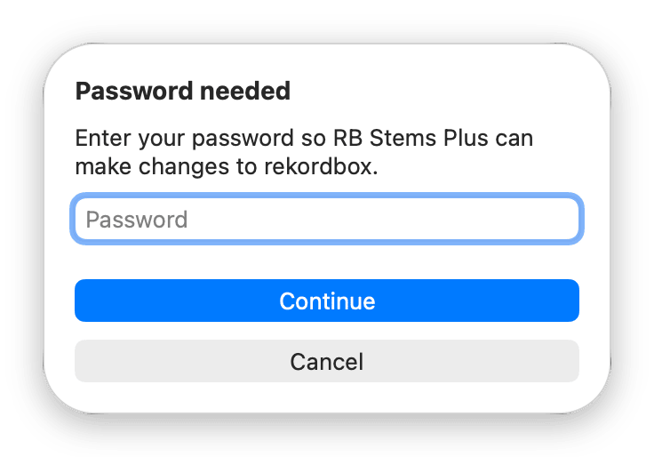
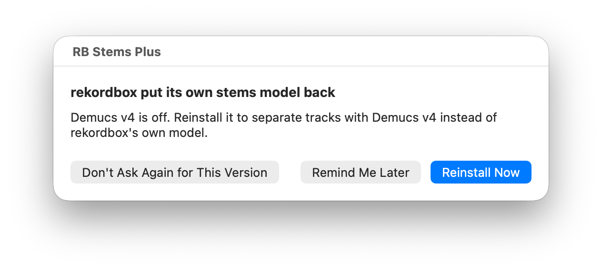

# RB Stems Plus: troubleshooting

Find the message you saw, or what's going wrong, below. Every step RB Stems Plus takes is also
written in the log on the right of its window. In the app, **Help › RB Stems Plus
Troubleshooting** opens this page. Nothing here helped?
[Make a problem report](#making-a-problem-report).

**Installing**
- [RB Stems Plus wasn't installed](#rb-stems-plus-wasnt-installed) (Terminal)
- [Move RB Stems Plus to the Applications folder](#move-rb-stems-plus-to-the-applications-folder)
- [RB Stems Plus can't open, or Already open](#rb-stems-plus-cant-open-or-already-open)
- [The lights, the status line and greyed-out buttons](#the-lights-the-status-line-and-greyed-out-buttons)
- [rekordbox missing](#rekordbox-missing)
- [Open rekordbox and turn on STEMS once](#open-rekordbox-and-turn-on-stems-once)
- [My rekordbox version isn't supported](#my-rekordbox-version-isnt-supported)
- [Reinstall rekordbox](#reinstall-rekordbox)
- [Administrator needed](#administrator-needed)

**Messages while installing or uninstalling**
- [Download failed](#download-failed)
- [Low disk space](#low-disk-space)
- [Password needed or Wrong password](#password-needed-or-wrong-password)
- [Permission needed (RB Stems Plus was prevented from modifying apps)](#permission-needed-rb-stems-plus-was-prevented-from-modifying-apps)
- [Action interrupted](#action-interrupted)
- [rekordbox open](#rekordbox-open)
- [rekordbox updating](#rekordbox-updating)
- [Install failed or Reinstall failed](#install-failed-or-reinstall-failed)

**Using it**
- [The first STEMS on a track is slow](#the-first-stems-on-a-track-is-slow)
- [Reloading a track is still slow](#reloading-a-track-is-still-slow)
- [Stems Cache's light is yellow](#stems-caches-light-is-yellow)
- [Saved stems take too much space](#saved-stems-take-too-much-space)
- [rekordbox crashes, or STEMS stops working](#rekordbox-crashes-or-stems-stops-working)

**After updates**
- [Stems Cache is off after a rekordbox update](#stems-cache-is-off-after-a-rekordbox-update)
- [rekordbox was prevented from modifying apps](#rekordbox-was-prevented-from-modifying-apps)
- [Demucs v4 is off](#demucs-v4-is-off)
- [Reinstall reminders are off](#reinstall-reminders-are-off)
- [Update failed](#update-failed)
- [New Mac, Migration Assistant or Time Machine](#new-mac-migration-assistant-or-time-machine)

**Removing it**
- [Uninstall failed or Uninstall stopped](#uninstall-failed-or-uninstall-stopped)
- [No saved copy of rekordbox's model](#no-saved-copy-of-rekordboxs-model)
- [Remove RB Stems Plus Anyway](#remove-rb-stems-plus-anyway)
- [Several accounts on one Mac](#several-accounts-on-one-mac) (also *Already working*)
- [I dragged RB Stems Plus to the Trash](#i-dragged-rb-stems-plus-to-the-trash)
- [Removing everything without the app](#removing-everything-without-the-app)

**Help**
- [Making a problem report](#making-a-problem-report)

## Installing

### RB Stems Plus wasn't installed

Every problem the install command finds in Terminal starts with *"RB Stems Plus wasn't
installed:"* and ends with what to do. Do that, then paste the line again. The most common:

- **"...isn't RB Stems Plus (or is a link)":** something else has RB Stems Plus's name in the
  Applications folder. Move it out of the folder. If its name starts with a dot, it's hidden: in
  Finder, open Applications and press Cmd-Shift-Period to show hidden items.
- **"...is changing rekordbox or updating itself":** RB Stems Plus is busy. Let it finish (answer
  *Password needed* or *Permission needed* if one is open), then paste again.
- **"...didn't quit":** quit RB Stems Plus yourself, then paste again.
- **"couldn't download":** check your internet connection and VPN, and that github.com opens.
- **"couldn't be verified", "isn't valid", "damaged" or "Try again later":** the download wasn't
  exactly what we published. Nothing was changed. Try again later or on another network. If it
  keeps happening, [open an issue](https://github.com/Gabe-LS/rbstemsplus/issues) with the
  Terminal text.
- **"only an administrator can add apps":** see [Administrator needed](#administrator-needed).

### Move RB Stems Plus to the Applications folder

You see this in the status line, or *"Not in Applications"* when you try to update. You opened a
copy that isn't in the Applications folder, for example straight from a downloaded zip. Until
you move it, there are no reinstall reminders and no updates, and the complete uninstall can't
delete the app.

Paste the install command (see the [README](../README.md#install)), or drag the app into
Applications and open it from there.

macOS says the app is "damaged" or from an "unidentified developer"? It was downloaded with a
browser. Move it to the Trash and use the install command, which doesn't trigger that.

### RB Stems Plus can't open, or Already open

- **"...isn't a folder" or "...app.lock can't be used":** in Finder choose Go › Go to Folder,
  paste the path from the message, move that item to the Trash, then open RB Stems Plus again.
  If it was a link you made to keep saved stems on another disk: that isn't supported, and RB
  Stems Plus starts a new folder.
- **"Your account's home folder can't be found":** network and managed accounts aren't
  supported. [Make a report](#making-a-problem-report) the way it says under *Without the app*.
- **"RB Stems Plus can't run as root":** open it normally from Applications, not from Terminal
  with `sudo`.
- **"Already open":** use the window that's already open (Cmd-Tab to it). If it's frozen, quit it
  in Activity Monitor, then open it again.

### The lights, the status line and greyed-out buttons

The two lights at the top are one per feature:
- **green check:** on
- **yellow:** Stems Cache is installed but not saving stems right now (see
  [Stems Cache's light is yellow](#stems-caches-light-is-yellow))
- **red cross:** off

Hold the pointer over a light to see what it means.

The line under the buttons (the status line) says why something can't be installed:

| It says | See |
|---|---|
| rekordbox 7 isn't installed. | [rekordbox missing](#rekordbox-missing) |
| Open rekordbox and turn on STEMS once... | [Open rekordbox and turn on STEMS once](#open-rekordbox-and-turn-on-stems-once) |
| ...doesn't support ... yet. / ...isn't available for STEMS Engine ... yet. | [My rekordbox version isn't supported](#my-rekordbox-version-isnt-supported) |
| ...rekordbox's ONNX Runtime... reinstall rekordbox. | [Reinstall rekordbox](#reinstall-rekordbox) |
| ...needs an administrator account. | [Administrator needed](#administrator-needed) |
| Reinstall reminders are off... | [Reinstall reminders are off](#reinstall-reminders-are-off) |
| There's no saved copy of rekordbox's own stems model... | [No saved copy of rekordbox's model](#no-saved-copy-of-rekordboxs-model) |
| ~/Library/Caches/rbstemsplus is a link... | [Saved stems take too much space](#saved-stems-take-too-much-space) |
| RB Stems Plus X is available... | [Updating RB Stems Plus](../README.md#updating-rb-stems-plus) |

**Greyed-out buttons:**
- **Everything installed:** Install shows its full name, greyed out. There's nothing to install.
- **During an action:** every button, Settings, Update and Create Report are off, and the window
  won't close. Quitting waits up to a minute for a change to rekordbox to finish.
- **Standard account:** the Stems Cache buttons are off. See
  [Administrator needed](#administrator-needed).

### rekordbox missing

RB Stems Plus looks for rekordbox only at `/Applications/rekordbox 7/rekordbox.app`. A renamed or
moved rekordbox looks missing: put it back there. The status line says *"rekordbox 7 isn't
installed."*

- **When installing** (*"rekordbox isn't in the Applications folder. Install rekordbox from
  rekordbox.com, then try again."*): install rekordbox, then click Install again.
- **When uninstalling,** RB Stems Plus asks whether to remove the copy of rekordbox's files it
  kept for Stems Cache:
  - **If you only moved rekordbox,** click **Cancel**, put it back in `/Applications/rekordbox 7`,
    then uninstall again.
  - **Remove** deletes that copy (in `/Library/Application Support/rbstemsplus`). Nothing needs it
    once rekordbox is gone: Pioneer's installer can always reinstall rekordbox whole.
  - **Cancel** keeps it. **Uninstall RB Stems Plus Completely** then stops with *"Uninstall
    stopped"*, and nothing else is deleted.

### Open rekordbox and turn on STEMS once

RB Stems Plus needs rekordbox's STEMS Engine (the files STEMS uses) before it can install
Demucs v4.
1. Open rekordbox and switch to **Performance** mode.
2. Load a track and turn on **STEMS**. rekordbox offers to download the STEMS Engine: let it
   finish.
3. Quit rekordbox and go back to RB Stems Plus: **Install** works now.

You don't see STEMS at all in rekordbox? Then your rekordbox doesn't include it, and RB Stems Plus
can't add it.

### My rekordbox version isn't supported

The status line says *"...isn't available for STEMS Engine ... yet"*, *"...doesn't support
rekordbox ... yet"* or *"...doesn't support ONNX Runtime ... yet"*. RB Stems Plus has a list of the versions
it was tested with (rekordbox 7.2.17 to 7.2.19 in version 1.0). On anything else it doesn't
install, because a change inside rekordbox could make it fail.

- **rekordbox works normally meanwhile,** with its own model where Demucs v4 can't be used.
- **Demucs v4 can still work** on a rekordbox version Stems Cache doesn't support, as long as the
  STEMS Engine is on the list.
- **Nothing to do:** the list is updated online, and RB Stems Plus checks it each time you open
  it. If a newer RB Stems Plus is out, the status line says *"RB Stems Plus X is available"*:
  update it, newer versions may support more.

When this comes up after an update, the reminder has two buttons. **OK** asks again as soon as a
newer list allows a reinstall. **Don't Ask Again for This Version** stays quiet until rekordbox
or its STEMS Engine changes again.

### Reinstall rekordbox

RB Stems Plus changes rekordbox only when it's exactly as Pioneer's installer leaves it, and puts
rekordbox's original files back only from a complete, checked copy. It says **Reinstall
rekordbox** when:
- rekordbox isn't installed the way Pioneer's installer leaves it (for example, files other
  accounts can change, or a link where a folder should be). Nothing was changed.
- it has no complete copy of rekordbox's original files for this version. Nothing was changed.
- changing rekordbox failed and its original files couldn't be put back.

The status lines *"Stems Cache can't find rekordbox's ONNX Runtime: reinstall rekordbox."* and
*"rekordbox's ONNX Runtime isn't the original: reinstall rekordbox."* mean the same thing.

**Fix:** download rekordbox from rekordbox.com and install it over the current one. That gives
you Pioneer's original app again, and your library and settings stay. Then click Install (or
Reinstall) again.

This is also the fix if STEMS or track analysis stops working while Stems Cache is installed.

### Administrator needed

On a standard (non-administrator) account:
- the install command refuses (*"only an administrator can add apps to the Applications
  folder"*)
- Stems Cache can't be installed: the status line says *"Stems Cache needs an administrator
  account."*
- Stems Cache can't be removed or reinstalled: its buttons, and **Uninstall RB Stems Plus
  Completely**, are greyed out, and the status line says *"Removing Stems Cache needs an
  administrator account."* (or *"Reinstalling or removing..."*), even when another account
  installed it
- **Update RB Stems Plus** says *"Administrator needed"*

**Fix:** make your account an administrator (System Settings › Users & Groups), or do it from an
administrator account. Standard accounts haven't been fully tested yet.

## Messages while installing or uninstalling

### Download failed

Nothing was changed.
- **"Check your internet connection and try again":** check the connection and any VPN, and that
  github.com opens. RB Stems Plus doesn't use proxy settings, so behind a proxy downloads fail.
- **"couldn't be verified" or "didn't download correctly":** try again later or on another
  network. If it keeps happening, [make a report](#making-a-problem-report).

Offline, RB Stems Plus can reinstall from files it already has: Demucs v4 any time, Stems Cache
only if its files were downloaded in the last 7 days. A first install always needs internet.

### Low disk space

The message says about how much space RB Stems Plus needs, and nothing was changed. Free up that
much (empty the Trash), then try again. When uninstalling, *"Free up some space and try again"*
means the same.

To free space now, open **RB Stems Plus › Settings…** and click **Clear Saved Stems** (with
rekordbox closed). Lowering the size limit frees nothing until rekordbox next uses STEMS.

### Password needed or Wrong password

It's the password you use to log in to this Mac, from an administrator account. It's not your
Apple Account or rekordbox password.

- **Wrong password:** the sheet asks again until it's right. Type it again and click
  **Continue**.
- **Cancel** stops without a message, and nothing is changed. To install Stems Cache later,
  click **Install Stems Cache**.



### Permission needed (RB Stems Plus was prevented from modifying apps)

macOS protects apps from being changed by other apps. The first time RB Stems Plus changes
rekordbox (only for Stems Cache), macOS blocks it and shows *"RB Stems Plus was prevented from
modifying apps"*. Nothing has been changed at that point. RB Stems Plus shows *"Permission
needed"* with these steps:

1. In the notification, click **Allow**.
2. Turn on **RB Stems Plus** in the list, then confirm.
3. When macOS offers to quit and reopen RB Stems Plus, choose **Later**.
4. Back in RB Stems Plus, click **Try Again**.


**Chose Quit & Reopen instead of Later?** That's fine: see
[Action interrupted](#action-interrupted).

**Missed or closed the notification?** It only has **Allow…**, so closing or ignoring it means
no, and nothing is changed. To allow it later, open System Settings › Privacy & Security › App
Management, turn on RB Stems Plus, then click **Try Again**. Or click **Cancel** to stop there.

If macOS still refuses after you clicked **Try Again** three times, RB Stems Plus stops and
says the install failed (*"See the log in this window"*). Check the switch in App Management,
then click Install again.

**Why it comes back:** after RB Stems Plus updates itself, macOS asks once more, the next time it
installs, reinstalls or removes Stems Cache. It has no paid Apple developer identity, so macOS
sees the updated app as a new app.

**No message at all?** That's normal too. macOS only protects an app once it has been opened
since it was installed or updated. So right after rekordbox was installed or updated, RB Stems
Plus can change it without macOS asking.

### Action interrupted

RB Stems Plus quit in the middle of something, and says *"RB Stems Plus quit before "..." was
done. Continue it now?"*. Usually you chose **Quit & Reopen** at the macOS prompt: that's fine,
RB Stems Plus reopens by itself and shows this. It also happens if it crashed, you force-quit
it, or you logged out or restarted. Nothing was changed while macOS was blocking it.

Click **Continue**: it may ask for your password once more, then finishes. If rekordbox is open,
RB Stems Plus asks you to quit it first (*"rekordbox open"*): quit rekordbox, then click **Try
Again**. **Cancel** doesn't finish it: you can click the same button again later.

### rekordbox open

RB Stems Plus only changes things while rekordbox is closed, in every account on this Mac. Quit
rekordbox (Cmd+Q in rekordbox, in other accounts too, or log them out), then click the button
again.

If rekordbox was opened while RB Stems Plus was working (during the download or at *Password
needed*), it asks before changing anything: quit rekordbox and click **Try Again**. The same
happens after **Reinstall Now** in the reminder and after **Continue** in *"Action
interrupted"*. **Cancel** stops with nothing changed.

### rekordbox updating

RB Stems Plus starts nothing while rekordbox's updater or Pioneer's installer is running:
rekordbox is about to change. It also waits while macOS's Installer app or the `installer`
command installs anything (some company-managed Macs and Homebrew use it). Other apps' own
updaters don't count.

Wait until it's done, then try again. If it seems stuck, restart the Mac.

### Install failed or Reinstall failed

The message says what happened. Usually nothing was changed, or rekordbox has its original files
again.
- **"...isn't one RB Stems Plus knows":** rekordbox has a stems model RB Stems Plus doesn't
  recognise. Update RB Stems Plus if an update is offered, otherwise
  [make a report](#making-a-problem-report).
- **"...changed meanwhile":** rekordbox, or a STEMS Engine download, wrote at the same time. Try
  again.
- **"See the log in this window":** quit and reopen RB Stems Plus and try once more. Still
  failing? [Make a report](#making-a-problem-report).

## Using it

### The first STEMS on a track is slow

That's expected. Demucs v4 does more work: on an Apple Silicon Mac, a 6½-minute track takes
about 77 seconds instead of about 26. The fans may spin up meanwhile. With Stems Cache, the next
load of that track takes about 7 seconds.

- **Check that rekordbox doesn't run under Rosetta:** select rekordbox in Applications, press
  Cmd+I, and untick "Open using Rosetta" if it's ticked. Under Rosetta, STEMS is much slower.
- Only an Apple Silicon Mac has been tested.
- Too slow for you? Click **Uninstall Demucs v4** to go back to rekordbox's model.

### Reloading a track is still slow

**Check the lights first.** If Stems Cache's light is yellow or red, see [Stems Cache's light is yellow](#stems-caches-light-is-yellow) or
[Stems Cache is off after a rekordbox update](#stems-cache-is-off-after-a-rekordbox-update).

Other reasons a track gets separated again:
- its stems were removed: unused for 60 days, over the size limit, or **Clear Saved Stems**
- you're in another Mac account (each account has its own saved stems)
- you switched model (Demucs v4 or rekordbox's own): each has its own saved stems, used again
  when you switch back
- a new Demucs v4 model file came with an RB Stems Plus update (it starts a fresh set)
- the track's audio was edited

Renaming, re-tagging or moving a track doesn't matter: stems are found by the audio itself. None
of these fit? [Make a report](#making-a-problem-report): it shows what was found and what wasn't.

### Stems Cache's light is yellow

Yellow means Stems Cache is installed but isn't saving stems right now. Hold the pointer over the
light to see why:

- ***"Stems Cache doesn't support STEMS Engine ... yet."*** rekordbox downloaded a STEMS Engine
  that's newer than this Stems Cache, and Demucs v4 is off, so rekordbox uses that engine's
  model. rekordbox works as usual, but its stems aren't saved. When an RB Stems Plus update
  supports it, click **Reinstall Stems Cache**. Or click **Install Demucs v4**: Stems Cache
  then saves the stems Demucs v4 makes.
- ***"Stems Cache needs an update to save the stems of rekordbox's own model."*** The Stems Cache
  in rekordbox is from before it could do that. Click **Reinstall Stems Cache**.
- ***"Stems Cache was installed from another account on this Mac."*** Click **Install Stems
  Cache** to use it in this account too. It's already in rekordbox, so there's no password.
- ***"Stems Cache starts saving stems once rekordbox has downloaded its STEMS Engine."*** Open
  rekordbox and turn on STEMS once.
- ***"...rekordbox_model is 0 in config.ini."*** It was set by hand in
  `~/Library/Application Support/rbstemsplus/config.ini`. Change it to 1, or delete the line,
  then reopen rekordbox.
- ***"Stems Cache stopped saving stems: your disk has less than 25 GB free."*** (the number is
  your disk's). Stems Cache stops saving new stems when free space drops under 10% of the disk,
  50 GB at most, as Finder counts it (purgeable space included). That's about 25 GB on a 256 GB
  Mac and 50 GB on a 512 GB Mac or bigger. The stems it already saved still load much faster.
  It starts saving again by itself within a minute of there being enough room, while rekordbox
  is separating. This floor isn't a setting: the size limit in **Settings…** is separate.

Installing or reinstalling Stems Cache on a fuller disk says so too: *"Stems Cache will stop
saving stems while your disk has less than 25 GB free."*

### Saved stems take too much space

Open **RB Stems Plus › Settings…** (Cmd+,):
- **Stems Cache size limit (GB)** and **Remove stems unused for (days)** apply the next time
  rekordbox opens and uses STEMS. Lowering the limit frees space only then.
- **Clear Saved Stems** frees the space now (quit rekordbox first).

The stems are in `~/Library/Caches/rbstemsplus`. Don't move that folder or replace it with a
link: RB Stems Plus leaves a link alone, and the next time it can't open (see
[RB Stems Plus can't open](#rb-stems-plus-cant-open-or-already-open)).

*"Settings not saved"* or *"Saved stems not cleared"*: [make a report](#making-a-problem-report).

### rekordbox crashes, or STEMS stops working

Try these in order, checking rekordbox after each:
1. Click **Uninstall Stems Cache**: rekordbox gets Pioneer's files back.
2. Click **Uninstall Demucs v4**: rekordbox gets its own model back.
3. Reinstall rekordbox from rekordbox.com (see [Reinstall rekordbox](#reinstall-rekordbox)).

Then [make a report](#making-a-problem-report): it includes rekordbox's crash reports.

## After updates

### Stems Cache is off after a rekordbox update

That's expected. A rekordbox update (or reinstalling rekordbox) puts Pioneer's original app back,
which turns Stems Cache off. Demucs v4 keeps working, and your saved stems are kept.

When the update is done and rekordbox is closed, RB Stems Plus asks (*"rekordbox was updated"*).
Click **Reinstall Now**.

**No question came?**
- It waits until rekordbox quits.
- It doesn't ask again after **Don't Ask Again for This Version**.
- It can't ask if RB Stems Plus Watcher is turned off (see
  [Reinstall reminders are off](#reinstall-reminders-are-off)).

Any time, you can open RB Stems Plus and click **Reinstall**.

**Don't want Stems Cache back?** Click **Uninstall Stems Cache** anyway (it stays clickable while
its light is red): it removes the copies of Pioneer's files it kept for the old rekordbox
version. The complete uninstall does this too.

### rekordbox was prevented from modifying apps

With Stems Cache installed, every rekordbox update shows this once. Click **Allow** (and turn on
rekordbox in the list if macOS asks) so the update can finish. It happens because Stems Cache
re-signs rekordbox on your Mac, so Pioneer's updater counts as another app changing it. Without
Stems Cache, rekordbox updates silently.

The notification only has **Allow…**. If you close or ignore it, the update can't finish until
you allow it: turn on rekordbox in System Settings › Privacy & Security › App Management, then
update rekordbox again.

### Demucs v4 is off

A new STEMS Engine download puts rekordbox's own stems model back. The Demucs v4 light turns
red. Stems Cache goes on saving stems, now with rekordbox's model, if it supports that STEMS
Engine (otherwise its light turns yellow). RB Stems Plus asks you (*"rekordbox put its own stems
model back"*):



- **Reinstall Now** puts back only what went missing. If Stems Cache is still in place, that's
  just Demucs v4.
- The **Reinstall** button in the app reinstalls everything you chose: with Stems Cache it also
  re-signs rekordbox (about a minute).

Reinstalling works offline too, from the files RB Stems Plus already has (for Stems Cache, only
if they were downloaded in the last 7 days).

It says *"isn't available for STEMS Engine ... yet"* instead? See
[My rekordbox version isn't supported](#my-rekordbox-version-isnt-supported).

### Reinstall reminders are off

**RB Stems Plus Watcher** is RB Stems Plus's small helper (macOS told you *"RB Stems Plus
Watcher can run in the background"* when you installed). It's what asks you to reinstall after a
rekordbox update. If it's turned off in System Settings › General › Login Items & Extensions,
nothing asks, and the status line says *"Reinstall reminders are off. Turn on RB Stems Plus
Watcher in System Settings › General › Login Items & Extensions."*

Turn on **RB Stems Plus Watcher** there to get the reminders back. RB Stems Plus never turns it
back on by itself. Without the reminders, open RB Stems Plus after a rekordbox update and click
**Reinstall** if a light isn't green.

### Update failed

RB Stems Plus's own update didn't finish, and the app stayed as it was. The message starts with
the reason.

- **Usually it's App Management:** allow RB Stems Plus (see
  [Permission needed](#permission-needed-rb-stems-plus-was-prevented-from-modifying-apps)), then
  choose **Update RB Stems Plus** again.
- **"Not in Applications" or "Administrator needed":** see
  [Move RB Stems Plus to the Applications folder](#move-rb-stems-plus-to-the-applications-folder)
  or [Administrator needed](#administrator-needed).
- **Still failing:** paste the install command. It replaces the app in place, and your settings
  and saved stems stay.

### New Mac, Migration Assistant or Time Machine

*Not tested yet.* What's safe: open RB Stems Plus. If a light is red, click **Reinstall**. If
that fails, reinstall rekordbox (see [Reinstall rekordbox](#reinstall-rekordbox)), then click
**Install**.

## Removing it

### Uninstall failed or Uninstall stopped

If Stems Cache can't be removed, nothing else is removed either. The message gives the reason:
see [rekordbox open](#rekordbox-open), [rekordbox updating](#rekordbox-updating),
[Reinstall rekordbox](#reinstall-rekordbox) or
[Permission needed](#permission-needed-rb-stems-plus-was-prevented-from-modifying-apps), then
uninstall again.

- **"...couldn't remove its copy of rekordbox's files":** try again. Still failing?
  [Make a report](#making-a-problem-report).
- **rekordbox's own stems model can't be put back:** **Open Help** brings you to one of the next
  two sections.

### No saved copy of rekordbox's model

RB Stems Plus saves rekordbox's own stems model before Demucs v4 replaces it, and puts it back
when you uninstall. If there's no saved copy, or it doesn't verify, uninstalling stops and says
so; nothing is deleted. This can happen if `~/Library/Application Support/rbstemsplus` was
deleted by hand, or on a Mac that had a test version of RB Stems Plus.

rekordbox downloads its own model again when its model folder is missing, exactly as Pioneer
ships it:

1. Quit rekordbox.
2. In Finder, choose Go › Go to Folder, paste
   `~/Library/Application Support/Pioneer/rekordbox6/models` and press Return. Move the
   `demucs3_model` folder to the Trash (or rename it).
3. Open rekordbox, load a track and turn on **STEMS**. rekordbox asks *"No data for STEMS
   Engine. Do you want to download it? (File size: 181.9 MB)"*. Click **Yes** and let it finish.
   (**No** turns STEMS off in rekordbox.)

Then uninstall again: RB Stems Plus sees rekordbox's own model and finishes. If it asks to
reinstall Demucs v4 meanwhile, click **Remind Me Later**.

### Remove RB Stems Plus Anyway

When **Uninstall Demucs v4** (*"Uninstall failed"*) or **Uninstall RB Stems Plus Completely**
(*"Uninstall stopped"*) can't put rekordbox's own stems model back, it says why. Nothing is
deleted. **Open Help** brings you here, or to
[No saved copy of rekordbox's model](#no-saved-copy-of-rekordboxs-model) when there's no saved
copy that verifies.

- **Not enough free space:** it says *"Free up some space and try again"*. Do that, then
  uninstall again. Nothing else is offered: trying again works.
- **Anything else** (no saved copy, a saved copy that doesn't verify, a stems model in rekordbox
  that RB Stems Plus doesn't know, a file it can't read or replace): the complete uninstall
  offers **Remove RB Stems Plus Anyway**. That deletes only RB Stems Plus's own files in your
  account: its settings, the stems it saved, its logs, RB Stems Plus Watcher and the app. It
  never touches rekordbox or `/Library/Application Support/rbstemsplus`.

A stems model RB Stems Plus doesn't know may be a newer Demucs v4 model file, so it isn't taken for
rekordbox's own. RB Stems Plus never deletes a saved copy of rekordbox's own model that verifies:
the folder `~/Library/Application Support/rbstemsplus/originals` stays, and the last message says
so. To put that copy back, follow step 3 of
[Removing everything without the app](#removing-everything-without-the-app). Then you can move the
`rbstemsplus` folder in `~/Library/Application Support` to the Trash.

The last message also says what's in rekordbox now, usually the Demucs v4 model. With no saved
copy, see [No saved copy of rekordbox's model](#no-saved-copy-of-rekordboxs-model).

### Several accounts on one Mac

- **Demucs v4** is per account: each account has its own rekordbox settings. Install and
  uninstall it in each account that uses it.
- **Stems Cache** changes rekordbox itself, which every account shares. If you uninstall from an
  account that didn't install it, RB Stems Plus asks first (*"Stems Cache from another
  account"*): **Remove** turns it off in every account, **Keep** leaves it.
- **rekordbox must be closed in every account** while RB Stems Plus changes things.
- **"Already working":** RB Stems Plus in another account is changing rekordbox, or a change is
  just finishing. Nothing was changed. Wait a moment, then try again.
- **Uninstall RB Stems Plus Completely** deletes the app only from the account that installed
  it. In the other accounts it removes only that account's own files. If Stems Cache is still
  installed for another account when the app is deleted, the last message says so: that account
  needs to paste the install command again to get the app back.
- **To remove everything,** uninstall in each account, ending with the one that installed RB
  Stems Plus.

### I dragged RB Stems Plus to the Trash

That doesn't undo anything: rekordbox keeps Demucs v4 and Stems Cache. And you get no more
reinstall reminders after rekordbox updates.

**Fix:** paste the install command (see the [README](../README.md#install)), then click
**Uninstall RB Stems Plus Completely**.

### Removing everything without the app

Normally use **Uninstall RB Stems Plus Completely** in the app. If the app is gone and the
install command can't bring it back:

1. Quit rekordbox.
2. **Stems Cache:** download rekordbox from rekordbox.com and install it over the current one.
   That puts Pioneer's original app back. **Do this before step 4:** without it, rekordbox's
   STEMS stops working.
3. **Demucs v4:** in Finder, choose Go › Go to Folder, paste
   `~/Library/Application Support/rbstemsplus/originals`. rekordbox's own model is the `.onnx`
   file named with a long string of letters and digits. If there are several, take the one whose
   `.engine` file (open it with TextEdit) holds the same number as `demucs3_ver.txt` in
   rekordbox's model folder below. Copy it into
   `~/Library/Application Support/Pioneer/rekordbox6/models/demucs3_model/` and rename it
   `hdemucs.onnx`, replacing the file there. Never use a file whose name starts with `ours-`:
   that's the Demucs v4 model. No such file? See
   [No saved copy of rekordbox's model](#no-saved-copy-of-rekordboxs-model).
4. **The rest,** in Terminal:

   ```sh
   launchctl bootout gui/$(id -u)/io.github.rbstemsplus.watcher
   rm -f ~/Library/LaunchAgents/io.github.rbstemsplus.watcher.plist
   rm -rf ~/Library/Application\ Support/rbstemsplus ~/Library/Caches/rbstemsplus ~/Library/Logs/rbstemsplus
   sudo rm -rf /Library/Application\ Support/rbstemsplus
   rm -rf /Applications/RB\ Stems\ Plus.app /Applications/.RB\ Stems\ Plus.update.app /Applications/.RB\ Stems\ Plus.old.app /Applications/.RB\ Stems\ Plus.new.app /Applications/.RB\ Stems\ Plus.bootstrap-old.app
   ```

5. **The App Management entries (optional):** the complete uninstall removes RB Stems Plus's
   own. rekordbox's entry (added when you allowed an update) stays, and it's harmless. To remove
   an entry: System Settings › Privacy & Security › App Management, select it, then click the
   minus button.

## Help

### Making a problem report

Help happens in this project's [GitHub issues](https://github.com/Gabe-LS/rbstemsplus/issues).
You need a free GitHub account.

1. In RB Stems Plus, choose **Help › Create Report**. It saves a zip on your Desktop (macOS may
   ask once whether RB Stems Plus may use the Desktop; if you say no, the zip goes to
   `~/Library/Logs/rbstemsplus/reports`). Nothing is sent.
2. In *"Report saved"*, click **Open GitHub Issue**. Your browser opens a new issue with the
   technical details already filled in, and Finder shows the zip.
3. Under *What happened?*, write what you did and what you expected. Drag the zip into the
   issue, then submit it.

The report holds RB Stems Plus's logs and settings, the versions of macOS, rekordbox and RB Stems
Plus, what's installed, rekordbox's error messages from the last 30 minutes (from macOS's log),
and up to five rekordbox or RB Stems Plus crash reports from the last week. It never includes
your rekordbox library, account files or music, and the logs never name tracks. Your
user name, home folder and anything that looks like an email address or a key are replaced.
It's plain text: look inside before sending if you like.

**"Report failed", or without the app:** in Finder, choose Go › Go to Folder, paste
`~/Library/Logs/rbstemsplus`, compress the folder (right-click › Compress) and attach that to a
[new issue](https://github.com/Gabe-LS/rbstemsplus/issues/new). These raw logs may show your Mac
user name in file paths.
